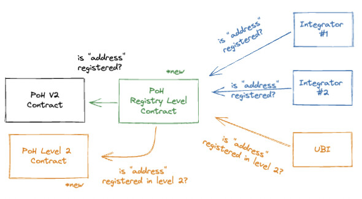

# ProofOfHumanityRegistryLevel

This contract is a proxy between the Proof of Humanity registry and any integrator.

It's composed with a base ProofOfHumanity core contract and a side "soft" registry contract.



The PoH v1 or PoH v2 contracts are supposed to be that "base contract" or "core registry". So, the first level (level=1) is the actual registry and the soft is considered a level=2 registry. This [HIP](https://gov.proofofhumanity.id/t/phase-1-hip-xx-explicit-account-management/2328/8) describes a way to build a side-registry (level=2) more inclusive and less strict.

## isRegistered

The actual implementation on ProofOfHumanityLevel contract:

```
    /** @dev
     * To be "registered" means that you are registered in the PoH core registry AND you aren't registered in the soft registry
     */
    function isRegistered(address _submissionID) external view returns (bool){
        return !proofOfHumanitySoft.isRegistered(_submissionID) && proofOfHumanityCore.isRegistered(_submissionID);
    }

    /** @dev
     * To be "soft registered" means that you are registered in the PoH core registry AND you are in the soft registry
     */
    function isSoftRegistered(address _submissionID) external view returns (bool){
        return proofOfHumanitySoft.isRegistered(_submissionID) && proofOfHumanityCore.isRegistered(_submissionID);
    }
```

## Local development

Install hardhat with `npm install --save-dev hardhat`.

Run test with `npx hardhat test`
